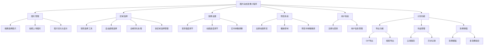
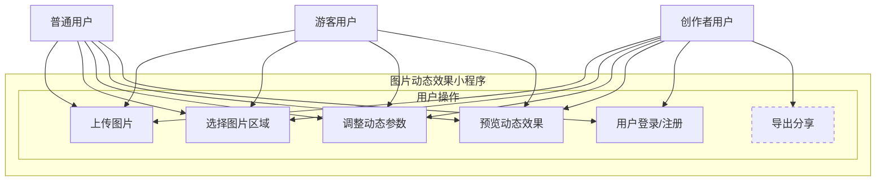
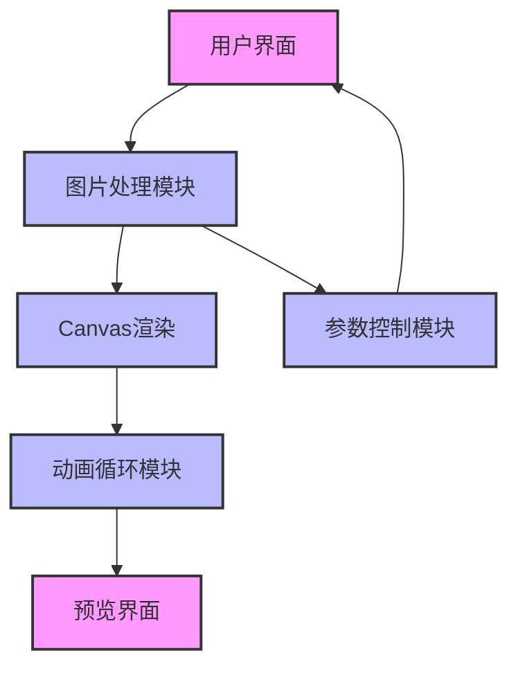
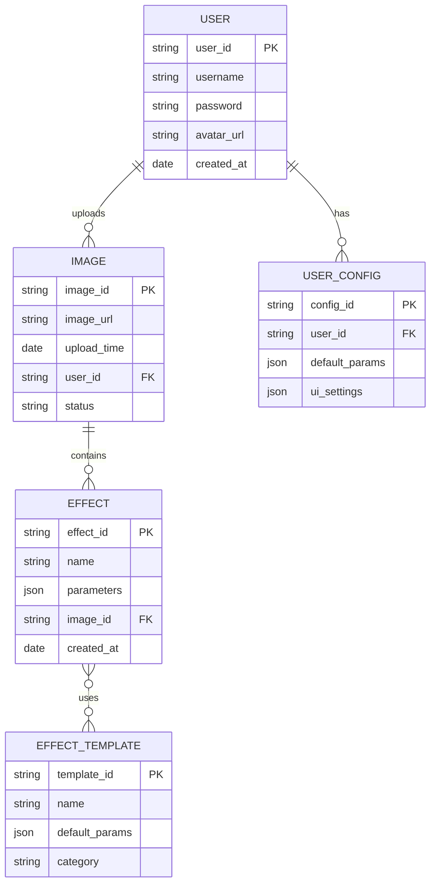
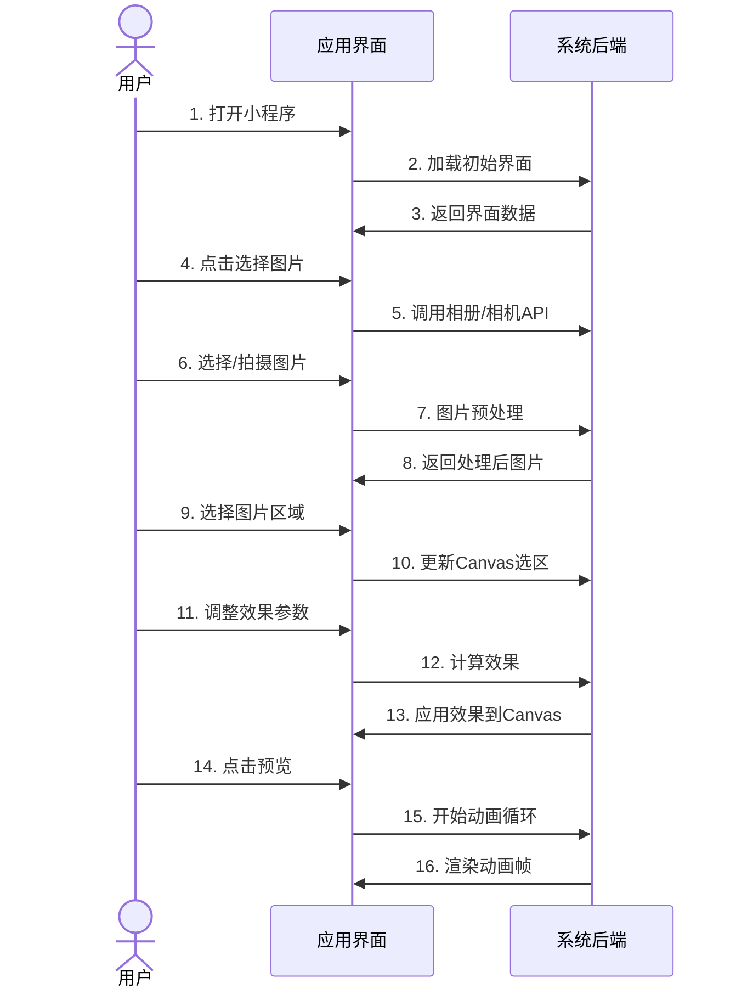
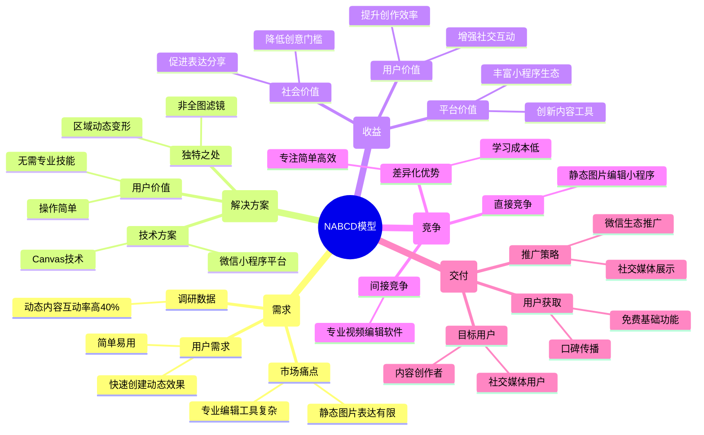
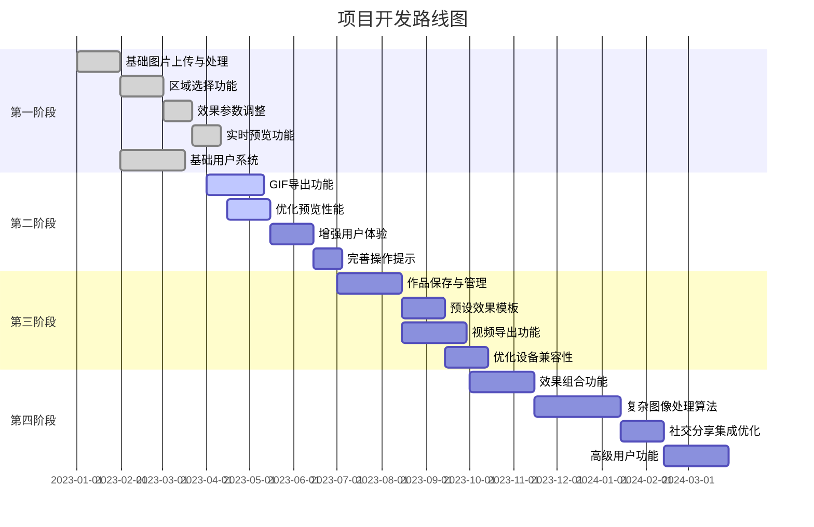

# 图片动态效果小程序需求分析图表 - Mermaid代码

## 1. 产品功能结构图

```mermaid
graph TD
    A[图片动态效果小程序] --> B[图片管理]
    A --> C[区域选择]
    A --> D[效果设置]
    A --> E[预览系统]
    A --> F[用户系统]
    A --> G[计划功能]
    
    B --> B1[相册选择图片]
    B --> B2[拍照上传图片]
    B --> B3[图片优化与显示]
    
    C --> C1[矩形选择工具]
    C --> C2[自由画笔选择]
    C --> C3[边缘羽化处理]
    C --> C4[多区域选择管理]
    
    D --> D1[变形强度调节]
    D --> D2[动画速度调节]
    D --> D3[实时参数调整]
    
    E --> E1[全屏动画预览]
    E --> E2[播放控制]
    E --> E3[预览时参数微调]
    
    F --> F1[注册与登录]
    F --> F2[用户信息管理]
    
    G --> G1[导出功能]
    G --> G2[作品管理]
    G --> G3[效果增强]
    
    G1 --> G1A[GIF导出]
    G1 --> G1B[视频导出]
    
    G2 --> G2A[云端保存]
    G2 --> G2B[历史记录]
    
    G3 --> G3A[效果模板]
    G3 --> G3B[多效果组合]
```

## 2. UML用例图

```mermaid
graph TD
    subgraph 图片动态效果小程序
        subgraph 用户操作
            U1[上传图片]
            U2[选择图片区域]
            U3[调整动态参数]
            U4[预览动态效果]
            U5[用户登录/注册]
            U6[导出分享]
        end
    end
    
    A[普通用户] --> U1
    A --> U2
    A --> U3
    A --> U4
    A --> U5
    
    B[创作者用户] --> U1
    B --> U2
    B --> U3
    B --> U4
    B --> U5
    B --> U6
    
    C[游客用户] --> U1
    C --> U2
    C --> U3
    C --> U4
    
    style U6 stroke-dasharray: 5 5
```

## 3. 数据流分析图

```mermaid
graph TD
    A[用户界面] --> B[图片处理模块]
    B --> C[Canvas渲染]
    B --> D[参数控制模块]
    D --> A
    C --> E[动画循环模块]
    E --> F[预览界面]
    
    style A fill:#f9f,stroke:#333,stroke-width:2px
    style F fill:#f9f,stroke:#333,stroke-width:2px
    style B fill:#bbf,stroke:#333,stroke-width:2px
    style C fill:#bbf,stroke:#333,stroke-width:2px
    style D fill:#bbf,stroke:#333,stroke-width:2px
    style E fill:#bbf,stroke:#333,stroke-width:2px
```

## 4. 系统E-R图

```mermaid
erDiagram
    USER ||--o{ IMAGE : uploads
    USER ||--o{ USER_CONFIG : has
    IMAGE ||--o{ EFFECT : contains
    EFFECT }o--o{ EFFECT_TEMPLATE : uses
    
    USER {
        string user_id PK
        string username
        string password
        string avatar_url
        date created_at
    }
    
    IMAGE {
        string image_id PK
        string image_url
        date upload_time
        string user_id FK
        string status
    }
    
    EFFECT {
        string effect_id PK
        string name
        json parameters
        string image_id FK
        date created_at
    }
    
    USER_CONFIG {
        string config_id PK
        string user_id FK
        json default_params
        json ui_settings
    }
    
    EFFECT_TEMPLATE {
        string template_id PK
        string name
        json default_params
        string category
    }
```

## 5. 用例交互图

```mermaid
sequenceDiagram
    actor User as 用户
    participant UI as 应用界面
    participant Backend as 系统后端
    
    User->>UI: 1. 打开小程序
    UI->>Backend: 2. 加载初始界面
    Backend->>UI: 3. 返回界面数据
    User->>UI: 4. 点击选择图片
    UI->>Backend: 5. 调用相册/相机API
    User->>UI: 6. 选择/拍摄图片
    UI->>Backend: 7. 图片预处理
    Backend->>UI: 8. 返回处理后图片
    User->>UI: 9. 选择图片区域
    UI->>Backend: 10. 更新Canvas选区
    User->>UI: 11. 调整效果参数
    UI->>Backend: 12. 计算效果
    Backend->>UI: 13. 应用效果到Canvas
    User->>UI: 14. 点击预览
    UI->>Backend: 15. 开始动画循环
    Backend->>UI: 16. 渲染动画帧
```

## 6. NABCD模型分析图

```mermaid
mindmap
  root((NABCD模型))
    Need(需求)
      ::icon(fa fa-question-circle)
      市场痛点
        静态图片表达有限
        专业编辑工具复杂
      用户需求
        简单易用
        快速创建动态效果
      调研数据
        动态内容互动率高40%
    Approach(解决方案)
      ::icon(fa fa-lightbulb)
      技术方案
        微信小程序平台
        Canvas技术
      独特之处
        区域动态变形
        非全图滤镜
      用户价值
        操作简单
        无需专业技能
    Benefit(收益)
      ::icon(fa fa-plus-circle)
      用户价值
        提升创作效率
        增强社交互动
      平台价值
        丰富小程序生态
        创新内容工具
      社会价值
        降低创意门槛
        促进表达分享
    Competitors(竞争)
      ::icon(fa fa-users)
      直接竞争
        静态图片编辑小程序
      间接竞争
        专业视频编辑软件
      差异化优势
        专注简单高效
        学习成本低
    Delivery(交付)
      ::icon(fa fa-truck)
      目标用户
        社交媒体用户
        内容创作者
      推广策略
        微信生态推广
        社交媒体展示
      用户获取
        免费基础功能
        口碑传播
```

## 7. 开发阶段路线图

```mermaid
gantt
    title 项目开发路线图
    dateFormat  YYYY-MM-DD
    section 第一阶段
    基础图片上传与处理    :done, a1, 2023-01-01, 30d
    区域选择功能          :done, a2, after a1, 30d
    效果参数调整          :done, a3, after a2, 20d
    实时预览功能          :done, a4, after a3, 20d
    基础用户系统          :done, a5, after a1, 45d
    
    section 第二阶段
    GIF导出功能          :active, b1, 2023-04-01, 40d
    优化预览性能          :active, b2, 2023-04-15, 30d
    增强用户体验          :b3, after b2, 30d
    完善操作提示          :b4, after b3, 20d
    
    section 第三阶段
    作品保存与管理        :c1, 2023-07-01, 45d
    预设效果模板          :c2, after c1, 30d
    视频导出功能          :c3, after c1, 45d
    优化设备兼容性        :c4, after c2, 30d
    
    section 第四阶段
    效果组合功能          :d1, 2023-10-01, 45d
    复杂图像处理算法      :d2, after d1, 60d
    社交分享集成优化      :d3, after d2, 30d
    高级用户功能          :d4, after d3, 45d
``` 